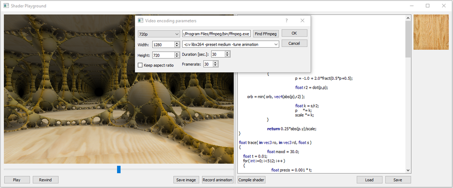

# PyShaderPlayground

PyShaderPlayground is a simple tool for editing GLSL fragment shaders and instantly testing them in an OpenGL window. There're few predefined uniforms, like image resolution or running time. The names of those are made to be compatible with *ShaderToy*. The editor has a simple syntax highlighting.

## Requirements

PyShaderPlayground is written in *Python 3.8* and *Qt*.

* Python 3.8.5
* pyside2 5.13.2
* pyopengl 3.1.5

There's also a Visual Code workspace included.
