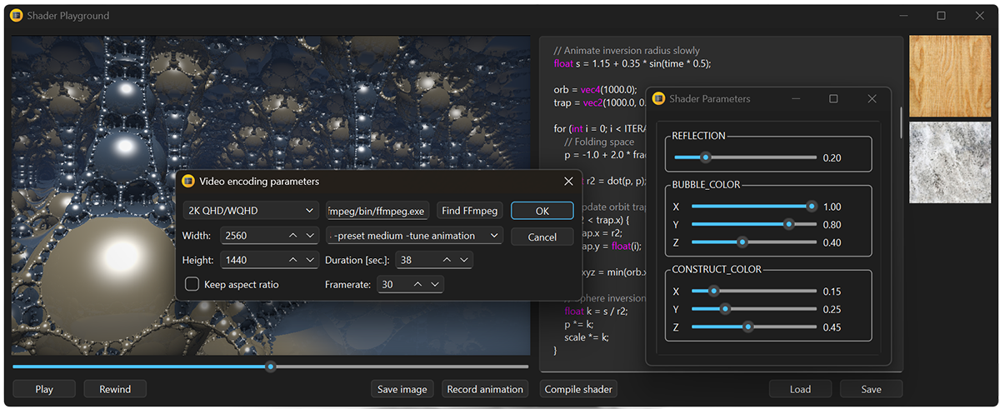

# PyShaderPlayground

PyShaderPlayground is a tool for editing GLSL fragment shaders and instantly testing them in an OpenGL window. There're few predefined uniforms, like image resolution or running time. The names of those are made to be compatible with [ShaderToy](https://www.shadertoy.com/). 

Some of the feature:

- adapting to system theme (dark/light mode)
- simple syntax highlighting
- 2 slots for textures loading
- offscreen rendering to render high resolution images
- animation rendering (resolution, fps and length)
- ffmpeg integration for animation rendering
- support for sound textures, for visualizations of sound
- dynamic sliders for uniforms declared directly in the code




## Requirements

PyShaderPlayground is written in *Python 3.12* and *Qt* (*PySide6*).

* Python 3.12.7
* PySide6 6.11.0
* PyOpenGL 3.1.7
* scipy 1.14.1
* matplotlib 3.9.2
* scikit-image 0.24.0

## Creating standalone app ##

There's a possibility to use PyInstaller to create a standalone application, 
outside of Python environment (also for Windows).
There's a proper _spec_ file included, which defines all needed things in order
to achieve that. Just run:

```
pyinstaller --clean PyShaderPlayground.spec
```
