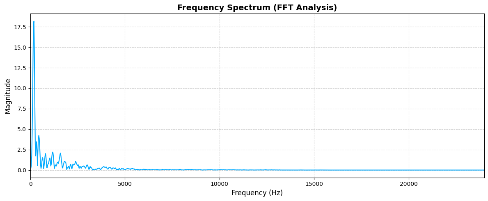
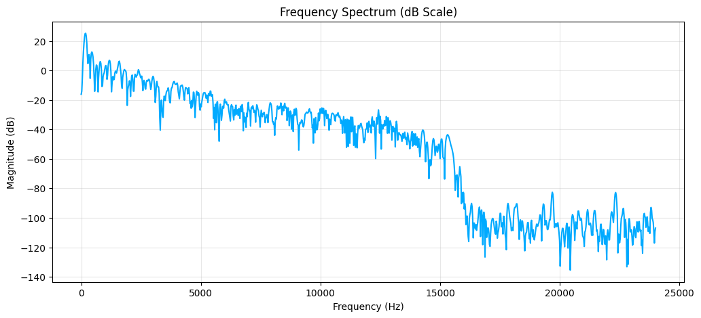
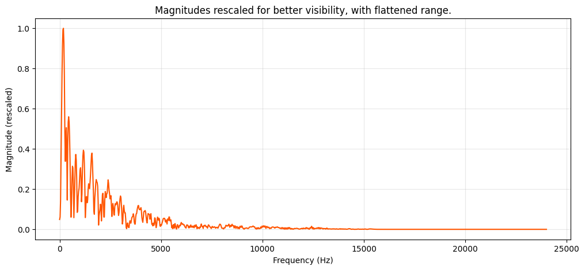

This isn't really about scientific sound analysis - and that's something we have to keep in mind.
We want the data describing what's happening in the audio - in simple to understand **visual** way.
First, let's take a portion of audio:


```python
import numpy as np
import librosa

def get_audio_part(audio, time_start=0.0, sample_rate=44100, num_samples=512):
    sample_start = int(time_start * sample_rate)
    sample_end = sample_start + num_samples
    
    # Handle padding if we reach the end of the audio
    if sample_end > len(audio):
        audio_part = audio[sample_start:]
        audio_part = np.pad(audio_part, (0, num_samples - len(audio_part)), 'constant')
    else:
        audio_part = audio[sample_start:sample_end]
        
    return audio_part

audio_, sample_rate_ = librosa.load("test_sound_01.mp3", mono=True, sr=None)
position = 0.0 # position in the audio file
signal = get_audio_part(audio_, position, sample_rate_, 2048)
```

Now we can perform a regulat FFT analysis of frequencies. We will use [Hann window](https://numpy.org/doc/2.3/reference/generated/numpy.hanning.html) filtering.


```python
window = np.hanning(len(signal))
windowed_signal = signal * window
freqresp = np.fft.rfft(windowed_signal)
```


```python
freqs = np.fft.rfftfreq(len(signal), 1/sample_rate_)

plt.figure(figsize=(12, 5))
plt.plot(freqs, np.abs(freqresp), color='#00aaff', linewidth=1.5)
plt.title("Frequency Spectrum (FFT Analysis)", fontsize=14, fontweight='bold')
plt.xlabel("Frequency (Hz)", fontsize=12)
plt.ylabel("Magnitude", fontsize=12)
plt.grid(True, linestyle='--', alpha=0.6)

plt.xlim(0, sample_rate_ / 2)
plt.tight_layout()
plt.show()
```


    

    


To better understand what's happening thwre, let's move it to dB scale:


```python
magnitude_db = 20 * np.log10(np.abs(freqresp) + 1e-9)
plt.figure(figsize=(12, 5))
plt.plot(freqs, magnitude_db, color='#00aaff')
plt.title("Frequency Spectrum (dB Scale)")
plt.xlabel("Frequency (Hz)")
plt.ylabel("Magnitude (dB)")
plt.grid(True, alpha=0.3)
plt.show()
```


    

    


As we can see, the values range is **huge**. Keeping in mind we will be mapping them to an image, encoding the magnitude to pixel's brightness, we will get few frequencies bright, and most of the rest just pitch black.

So, we need to make it less scientific - and more visually pleasing. We'll rescale the values - *flatten* them, to make it more image-friendly.

We'll start from logarithmic scaling (adding 1.0 to avoid values going to negative infinity) and then remapping them to a **0..1** range:


```python
magnitude = np.abs(freqresp)
magnitude = np.log10(magnitude + 1.0)
magrange = np.max(magnitude) - np.min(magnitude)
magnitude -= np.min(magnitude)
magnitude /= magrange

plt.figure(figsize=(12, 5))
plt.plot(freqs, magnitude, color='#ff5500')
plt.title("Magnitudes rescaled for better visibility, with flattened range.")
plt.xlabel("Frequency (Hz)")
plt.ylabel("Magnitude (rescaled)")
plt.grid(True, alpha=0.3)
plt.show()
```


    

    


Also, we will take only first 512 values from our FFT response. Remembering we took a 2048 window, FFT returned 1024 values, so our first 512 values will be representing **0..11025 Hz**.

Let's build our final texture. It will be 512 pixels wide. In fact should be 1 pixel high, but here we will use 100px, to better see it. It will use only one channel, RED.

> ℹ️ **Note:** 
When creating OpenGL texture, we have to keep in mind the texture has to be created only **once** (for instance, on music load), and then in each video frame just having the data being replaced. Also it shouldn't have any mip-mapping.


```python
from PIL import Image

array = magnitude[:512]
arrayuint8 = array.astype(np.float64)
arrayuint8 = 255 * arrayuint8
img = Image.fromarray(arrayuint8.astype(np.uint8), mode='L')
zero = np.zeros(array.shape, dtype=np.uint8)
img_zero = Image.fromarray(zero, mode='L')
img = Image.merge(mode='RGB', bands=(img, img_zero, img_zero))
img = img.rotate(90, expand=True)
img = img.resize((512, 100))
display(img)
```


    

    


In final visualizer, we will also add a second row of data, representing a waveform of the audio part, but that is pretty straightforward.
